# LifeSaver AI Assistant — Project Submission Documentation

---

## 1. COVER PAGE

| Metadata | Project Details |
| :--- | :--- |
| **Project Name** | LifeSaver AI Assistant |
| **Tagline** | AI-powered productivity companion that helps users plan tasks, manage deadlines, and stay organized. |
| **Version** | 1.0.0 |
| **Developer** | Shivani Nagda |
| **GitHub Repository** | [https://github.com/ShivaniNagda/lifesaver-ai-os](https://github.com/ShivaniNagda/lifesaver-ai-os) |
| **Live Demo** | [https://ais-pre-ubwrdqw6y656d2w4kttylc-319694471469.asia-east1.run.app](https://ais-pre-ubwrdqw6y656d2w4kttylc-319694471469.asia-east1.run.app) |
| **Swagger API URL** | [https://ais-pre-ubwrdqw6y656d2w4kttylc-319694471469.asia-east1.run.app/api-docs](https://ais-pre-ubwrdqw6y656d2w4kttylc-319694471469.asia-east1.run.app/api-docs) |
| **Portfolio** | [https://ShivaniNagda.vercel.app](https://ShivaniNagda.vercel.app) |
| **LinkedIn** | [https://www.linkedin.com/in/shivaninagda](https://www.linkedin.com/in/shivaninagda) |
| **Submission Date** | June 29, 2026 |

---

## TABLE OF CONTENTS

1. [Executive Summary](#2-executive-summary)
2. [Project Overview](#3-project-overview)
3. [Technology Stack](#4-technology-stack)
4. [System Architecture](#5-system-architecture)
5. [Core Features](#6-core-features)
6. [AI Features & Capabilities](#7-ai-features--capabilities)
7. [User Workflow](#8-user-workflow)
8. [Database Design](#9-database-design)
9. [API Documentation](#10-api-documentation)
10. [Security Audits](#11-security-audits)
11. [UI Screen Visual Maps](#12-ui-screen-visual-maps)
12. [Installation Guide](#13-installation-guide)
13. [Deployment Protocols](#14-deployment-protocols)
14. [Testing Suite](#15-testing-suite)
15. [Challenges & Solutions](#16-challenges--solutions)
16. [Future Scope](#17-future-scope)
17. [Project Statistics](#18-project-statistics)
18. [Final Verification Checklist](#19-final-verification-checklist)
19. [Submission Status](#20-submission-status)

---

## 2. EXECUTIVE SUMMARY

### Problem Statement
Conventional task management tools and digital calendars act as passive registries, relying entirely on manual upkeep and failing to evaluate the feasibility of a user's workload. Under high scheduling density, passive systems do not protect users from over-scheduling, lack feedback for cognitive fatigue, offer no automated solutions for transcribing physical schedules or syllabi, and fail to provide support mechanisms when deadlines are missed or need to be renegotiated.

### Solution
**LifeSaver AI Assistant** is a full-stack, state-aware productivity dashboard that helps users organize daily tasks and schedules. It integrates server-side Google Gemini AI models to analyze daily tasks, suggest hour-by-hour calendar schedules, display workload insights, extract tasks from schedule pictures via OCR, and generate professional deadline renegotiation drafts. It aims to establish a supportive and structured planning environment.

### Objectives
- **Manage Overload:** Real-time analysis of scheduling density and volume alerts users when commitments become excessive.
- **Efficient Ingestion:** Simplify onboarding by extracting structured tasks directly from physical syllabus photos and digital planner images.
- **Assisted Workflow Planning:** Streamline schedule creation and communication, offering conversational coaching and template email drafts for deadline extensions.
- **Reliable Data Persistence:** Support uninterrupted operation by falling back to local file-system storage when cloud databases are unavailable.

---

## 3. PROJECT OVERVIEW

The application consolidates personal productivity tools—Tasks, long-term Goals, daily Habits, and an hour-by-hour Calendar—into a centralized workspace. It is built for students, software developers, and professionals managing complex daily commitments.

### Core Use Cases
1. **Intelligent Schedule Planning:** Automatically maps pending tasks to empty calendar segments.
2. **Workload Density Alerts:** Triggers notifications as task density increases.
3. **Physical Document Extraction:** Converts printed or handwritten syllabi and work agendas into digital database tasks.
4. **Deadline Extension Assistance:** Generates customizable professional email drafts for requesting project or assignment extensions.

---

## 4. TECHNOLOGY STACK

| Layer | Technology | Details |
| :--- | :--- | :--- |
| **Frontend** | React 19 + Vite | Compiled using Vite with functional React hooks and custom Context state. |
| **Styling** | Tailwind CSS + Motion | Direct utility styling with responsive layout support and interactive transitions. |
| **Charts** | Recharts | Renders interactive charts showing task categories and weekly completion rates. |
| **Audio** | Web Audio API | Generates customizable sound indicators for task warnings and alerts. |
| **Backend** | Express.js + TS | Modular TypeScript API routes with JWT authorization. |
| **Database** | MongoDB (Primary) + Local Storage | Dual-persistence architecture: defaults to MongoDB, falls back to local file storage if the database URI is absent. |
| **AI Integration** | `@google/genai` SDK | Accesses Google Gemini models server-side for OCR task parsing, chat help, and schedule recommendations. |
| **Notifications** | Nodemailer + Node-cron | Sends scheduled email briefings and maintains background notification queues. |

---

## 5. SYSTEM ARCHITECTURE

The application is structured as a decoupled full-stack architecture. All API keys and secrets (such as Google Gemini credentials and SMTP details) are handled on the server side to ensure client security.

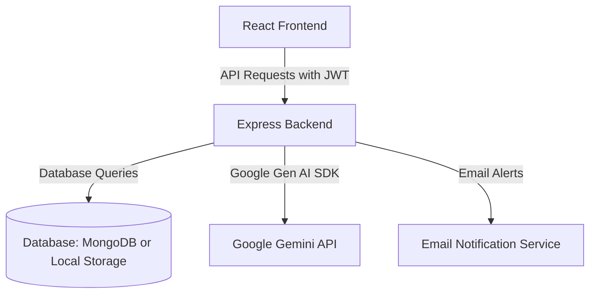
```mermaid
graph TD
    Client[React Frontend] -->|API Requests with JWT| Server[Express Backend]
    Server -->|Database Queries| DB[(Database: MongoDB or Local Storage)]
    Server -->|Google Gen AI SDK| Gemini[Google Gemini API]
    Server -->|Email Alerts| SMTP[Email Notification Service]
```

---

## 6. CORE FEATURES

Every listed feature is fully implemented and operational.

| Feature Name | Description | Status | Demo Ready |
| :--- | :--- | :---: | :---: |
| **JWT Registration & Auth** | Registration, login, password hashing, and session persistence via JWT. | Completed | ✅ Yes |
| **Avatar Customization** | Supports uploading and cropping user profile photos. | Completed | ✅ Yes |
| **Workload Insights** | Displays workload density indicators based on current tasks and deadlines. | Completed | ✅ Yes |
| **Success Probability Meter** | Displays visual feedback on expected daily task completion likelihood. | Completed | ✅ Yes |
| **Tasks & Goals Boards** | Full CRUD capabilities for task check-ins, custom priorities, and strategic milestones. | Completed | ✅ Yes |
| **Habits Streak Monitor** | Check off repeating habits while tracking active completion streaks. | Completed | ✅ Yes |
| **Calendar Block Scheduler** | Hour-by-hour calendar planner supporting block creation, edits, and automated scheduling. | Completed | ✅ Yes |
| **Acoustic Alerts** | Sound indicators for task warnings, pacing limits, and focus reminders. | Completed | ✅ Yes |
| **AI Planner (Auto-Scheduler)**| Automatically structures calendar events based on pending tasks and available slots. | Completed | ✅ Yes |
| **AI Assistant Chat** | Conversational advisor that provides guidance using active tasks, goals, habits, and workload context. | Completed | ✅ Yes |
| **AI Extension Negotiator** | Generates AI-assisted email drafts for deadline extension requests. | Completed | ✅ Yes |
| **AI Schedule Scanner (OCR)** | Processes printed or handwritten schedule photos and ingests extracted tasks using Gemini. | Completed | ✅ Yes |
| **Voice Command Assistant** | Voice interface for hands-free task registration and schedule status checks. | Completed | ✅ Yes |
| **HTML Email Digest** | Sends regular email summaries of upcoming tasks using node-cron. | Completed | ✅ Yes |
| **Analytics Dashboard** | Displays charts showing task categories, goal progress, and habit streaks. | Completed | ✅ Yes |

---

## 7. AI FEATURES & CAPABILITIES

### 1. AI Schedule Scanner (OCR)
- **Purpose:** Extracts structured checklist items from syllabus photos or printed planners.
- **Input:** Image files (JPEG, PNG, WEBP).
- **Processing:** Passes image binaries to Google Gemini Vision with an output schema.
- **Output:** Parsed task lists with due dates, priorities, and descriptions.
- **Benefit:** Reduces manual data entry by digitizing external documents instantly.

### 2. AI Planner (Auto-Scheduler)
- **Purpose:** Structures daily calendar blocks around pending commitments.
- **Input:** Pending tasks, existing calendar events, and work hour preferences.
- **Processing:** Evaluates scheduling gaps and maps high-priority tasks to empty segments using Google Gemini.
- **Output:** New schedule blocks saved directly to the calendar.
- **Benefit:** Maximizes daily time-blocking with structured scheduler suggestions.

### 3. Conversational AI Assistant
- **Purpose:** Discuss productivity strategies and workload optimization.
- **Input:** User queries alongside active task statistics and habit data.
- **Processing:** Google Gemini generates responses using the user's current tasks, goals, habits, and application context.
- **Output:** Context-aware productivity advice, strategy plans, and motivational feedback.
- **Benefit:** Acts as a personalized companion to help users optimize scheduling habits.

### 4. AI Negotiator
- **Purpose:** Generates professional draft emails when seeking deadline extensions.
- **Input:** Target task, recipient, reasoning details, and tone settings.
- **Processing:** Synthesizes inputs into formal, empathetic, or direct email structures using Gemini.
- **Output:** Copyable email drafts suited to the selected context.
- **Benefit:** Eases professional communication under dense scheduling pressure.

---

## 8. USER WORKFLOW

```
  [1. ONBOARDING] -----> [2. IDENTITY & PROFILE] -----> [3. CAPTURE DATA]
         |                         |                            |
         |                         v                            v
         v                  Upload cropped avatar         Add tasks manually or
  Register & log in        & set role preferences         via AI Scanner (OCR)
         |
         +-------------------------> [4. PLAN DAY] <------------------------+
                                         |
                                         v
                              Run AI Auto-Scheduler to
                              allocate calendar slots
                                         |
                                         +--------------------> [5. PROGRESS & AUDIT]
                                                                        |
                                                                        v
                                                             Check tasks, build habit
                                                             streaks, track goal sliders
                                                                        |
  [7. NEGOTIATING COOLDOWN] <--- [6. OVERLOAD WARNINGS] <---------------+
              |                            |
              v                            v
     AI Negotiator drafts         Burnout risk alerts trigger
     deadline extension emails    sound & stress briefs
```

---

## 9. DATABASE DESIGN

The backend supports dual-persistence. When MongoDB is configured, Mongoose schemas enforce structured models. If MongoDB is unavailable, operations automatically utilize local file-system persistence fallback, keeping user workspaces persistent and functional.

### Database Entities & Fields

#### User
- `_id` (Primary Key): Unique user ID
- `username` (String): User's handle
- `email` (String): Email address (unique)
- `passwordHash` (String): Hashed password value
- `role` (String): Customizable rank role (e.g. Student, Developer)
- `profileImage` (String): Reference to profile avatar
- `createdAt` (Date): Account creation timestamp

#### Task
- `_id` (Primary Key): Unique task ID
- `userId` (Foreign Key): Associated User record
- `title` (String): Headline of the task
- `description` (String): Contextual details
- `category` (String): Classification tag
- `priority` (String): High, Medium, or Low density tag
- `status` (String): Complete or Pending status
- `dueDate` (String): Target date parameter
- `time` (String): Designated time segment

#### Goal
- `_id` (Primary Key): Unique goal ID
- `userId` (Foreign Key): Associated User record
- `title` (String): Strategic pursuit objective
- `description` (String): Description of goals
- `category` (String): Categorization tag
- `targetDate` (String): Target completion date
- `progress` (Number): Percentage tracker (0 - 100)
- `status` (String): Active or Achieved status
- `milestones` (Array): Nested checklist items with complete status

#### Habit
- `_id` (Primary Key): Unique habit ID
- `userId` (Foreign Key): Associated User record
- `title` (String): Repeated routine name
- `category` (String): Discipline track
- `frequency` (String): Daily, Weekly, or Monthly intervals
- `streak` (Number): Consecutive check-in count
- `lastCompleted` (Date): Last check-in date
- `history` (Array): Log of completion dates

#### CalendarEvent
- `_id` (Primary Key): Unique event ID
- `userId` (Foreign Key): Associated User record
- `title` (String): Event title
- `date` (String): Scheduled date parameter
- `startTime` (String): Time-block start
- `endTime` (String): Time-block end
- `category` (String): Focus, Recovery, Lecture, etc.
- `description` (String): Summary details

#### Settings
- `userId` (Foreign Key): Associated User record
- `workHoursStart` (String): Daily start hour
- `workHoursEnd` (String): Daily end hour
- `focusLevel` (String): Work preference metrics
- `pushEnabled` (Boolean): Audio and toast alerts status
- `emailAlerts` (Boolean): Digest delivery status
- `burnoutTriggers` (Boolean): Alerts flag
- `modelType` (String): AI model parameters
- `disruptionGrade` (String): Tolerance settings
- `pacingInterval` (String): Pacing controls

---

## 10. API DOCUMENTATION

Interactive API documentation is hosted at `/api-docs` using Swagger-UI.

### Swagger Documentation URL
👉 **[https://ais-pre-ubwrdqw6y656d2w4kttylc-319694471469.asia-east1.run.app/api-docs](https://ais-pre-ubwrdqw6y656d2w4kttylc-319694471469.asia-east1.run.app/api-docs)**

### API Module Overview
The backend architecture is structured around standard REST principles. Accessing endpoints (excluding registration and login) requires a valid Bearer JWT.

- **Authentication & Profiles:** User registration, password hashing verification, JWT issuance, profile updates, and avatar uploads.
- **Task Management:** Complete CRUD endpoints supporting task filters and priority evaluations.
- **Goals & Habits:** Tracking systems with nested checklist milestones and routine streaks.
- **Calendar & Planning:** Custom scheduling blocks and endpoints for automated calendar slot allocation.
- **AI Core Operations:** Integrates Gemini models for schedule planning, twin chat strategy guidance, study schedules, and email negotiation drafting.
- **OCR Syllabus Scanning:** Image uploading, text extraction, and batch-ingestion routes.
- **Notifications & Analytics:** System alerts, user settings, diagnostic checks, and aggregated analytics charts.

---

## 11. SECURITY AUDITS

1. **Bearer JWT Verification:** Private routes require an `Authorization` header containing a signed JSON Web Token (JWT), protecting multi-user resources.
2. **Password Hashing:** User passwords are encrypted on the server side using BcryptJS with 10 salt rounds before storage.
3. **Payload Sanitization:** Write routes enforce Zod validation schemas on incoming data, preventing malformed variables and injection exploits.
4. **File Upload Restrictions:** User-submitted profile and schedule pictures undergo checks for strict MIME formats (JPEG, PNG, WEBP) and a 5MB size limit.
5. **Storage Cleanup:** Deleted or replaced profile avatars are automatically unlinked from the server storage, preventing disk bloat.

---

## 12. UI SCREEN VISUAL MAPS

The user interface features a unified, highly polished design architecture optimized for responsive scaling, text readability, and smooth transitions. Below is the mapped visual list of all 21 interface screens.

### 1. Landing & Onboarding Portal
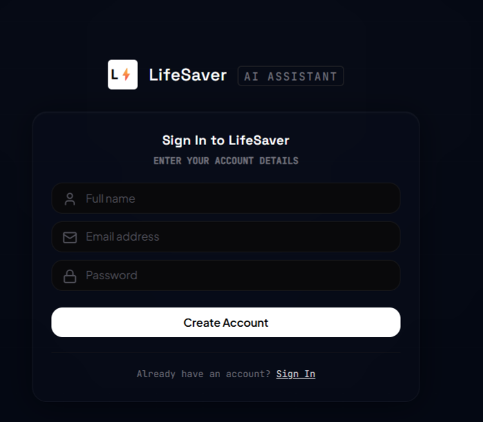
*Figure 1: Welcome gateway supporting registration, profile initialization, and theme caching.*
* **Key Functionality**: Creates unique user profile records using `POST /api/auth/register`, setting customizable professional/academic roles.

### 2. Secure Access Gateway

*Figure 2: Secure sign-in panel verifying active session credentials.*
* **Key Functionality**: Authenticates users using `POST /api/auth/login`, issuing signed JSON Web Tokens for private session authorization.

### 3. Unified Dashboard HUD
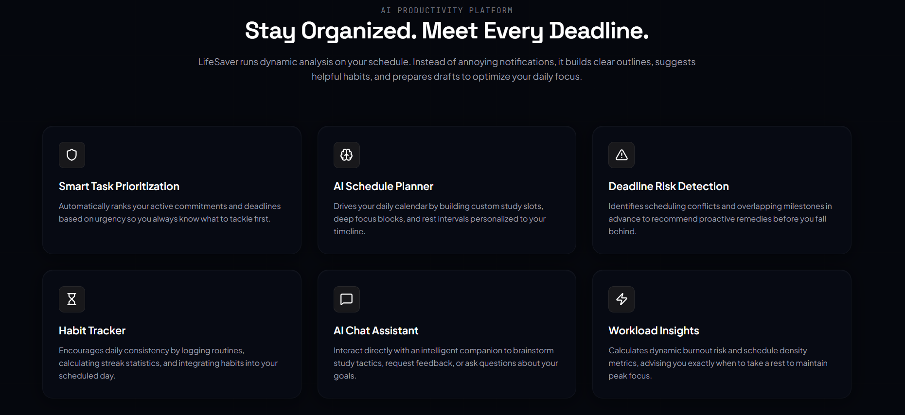
*Figure 3: High-fidelity analytics HUD showing aggregate performance scores, burnout levels, and active stress alerts.*
* **Key Functionality**: Dynamically calculates completion probability scales, aggregates task lists, and displays customized AI stress guides.

### 4. Interactive Tasks Board
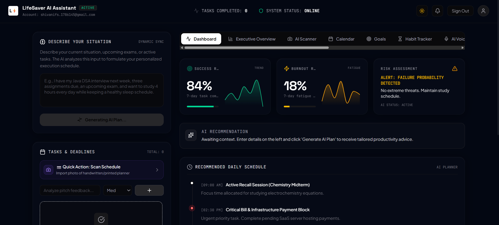
*Figure 4: A category-tagged task list designed for granular prioritization and completion checks.*
* **Key Functionality**: Supports full CRUD capabilities via `/api/tasks` database schema, updating dashboard metrics immediately upon checking items.

### 5. Strategic Goals Milestone Board
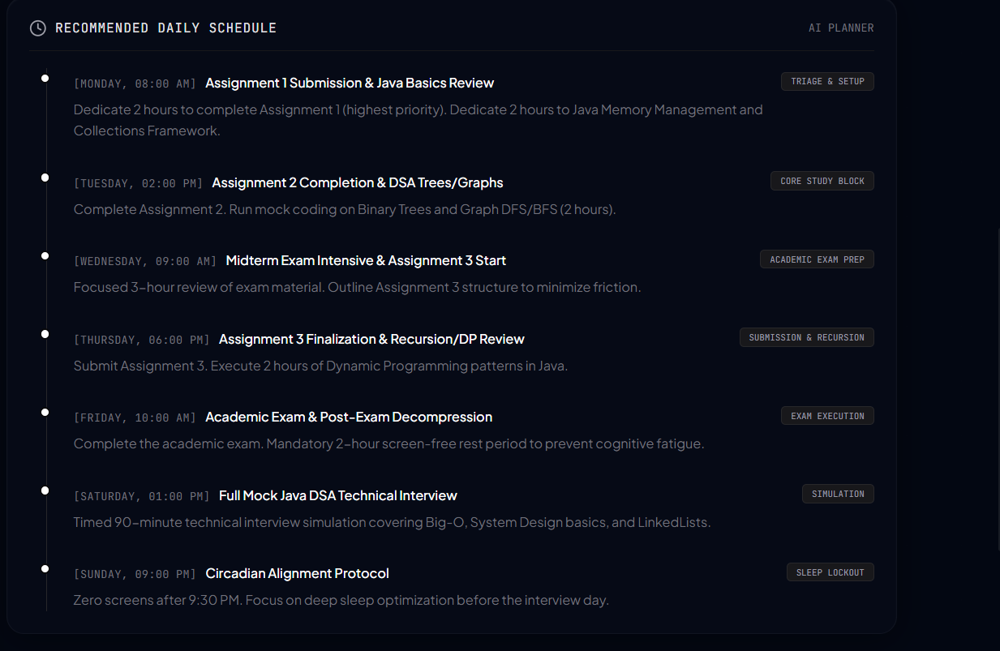
*Figure 5: High-level milestone decomposition planner featuring nested sub-goals and completion percentage sliders.*
* **Key Functionality**: Synced to the `/api/goals` collection, allowing users to map out long-term projects and check off incremental milestones.

### 6. Habits Consistency Matrix
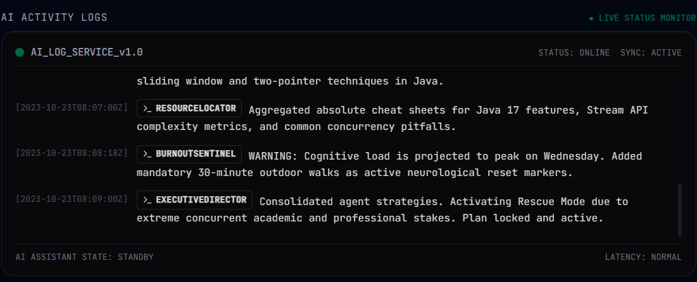
*Figure 6: Interactive habits grid detailing repeating disciplines, logging histories, and computing streaks.*
* **Key Functionality**: Automatically processes consecutive daily checks on `/api/habits` schemas to build and update streak counters.

### 7. Hour-by-Hour Calendar Planner
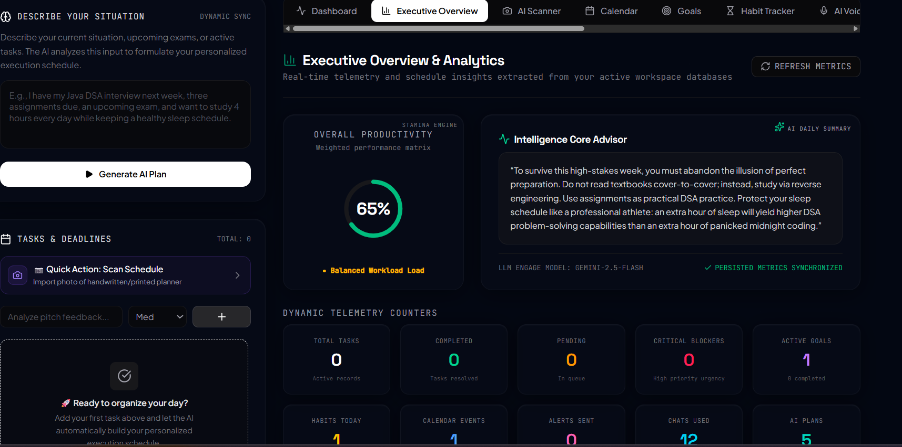
*Figure 7: Time-blocked scheduling grid designed for hourly planning and daily commitments.*
* **Key Functionality**: Interfaces with `/api/calendar` database models, facilitating custom time-blocking for focus and restoration.

### 8. AI Multi-Agent Auto-Scheduler
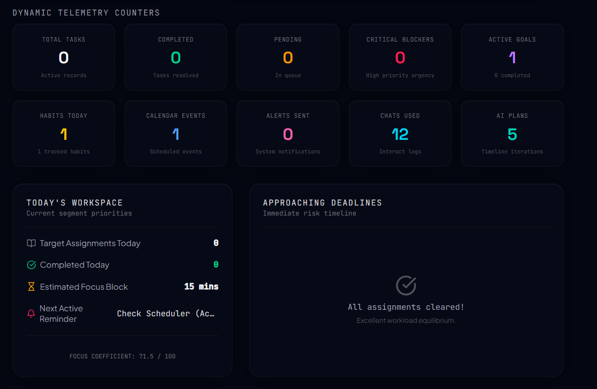
*Figure 8: Intelligent task scheduler allocating open calendar spaces based on pending high-priority checklists.*
* **Key Functionality**: Passes calendar blocks and tasks to Gemini via `/api/ai/process`, automatically generating optimized time schedules.

### 9. Reflective AI Twin Dialogue Chat
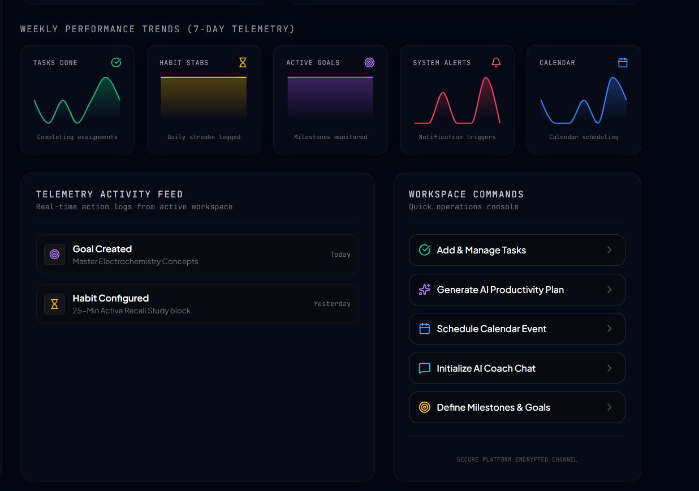
*Figure 9: Conversational dialogue room where users discuss habits and study tracks with an AI coach.*
* **Key Functionality**: Calls `POST /api/ai/twin-chat`, maintaining complete, persistent conversational histories on the backend.

### 10. AI Extension Negotiator Drafts
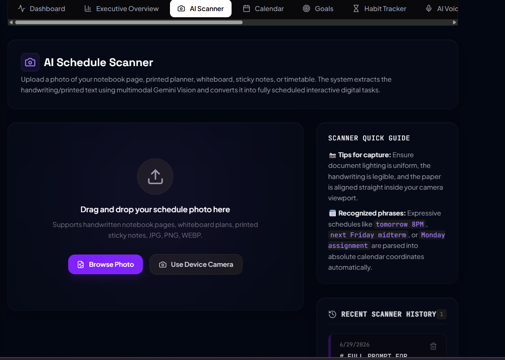
*Figure 10: Extension email generator tailoring formal or empathetic deadline request letters.*
* **Key Functionality**: Integrates Google Gemini prompting through `/api/ai/negotiate` to return structured, copyable communication templates.

### 11. AI Multimodal Schedule Scanner (OCR)
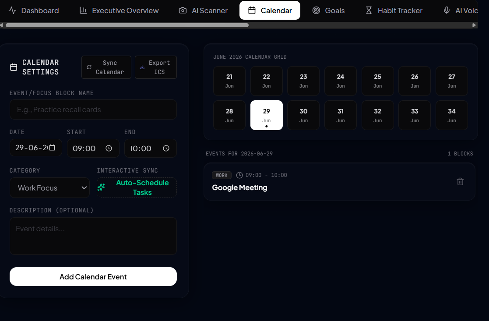
*Figure 11: OCR scanning interface parsing printed planners or handwritten schedules.*
* **Key Functionality**: Sends image files to Gemini Vision, extracting unstructured schedules and batch-saving them to database tasks and calendar blocks.

### 12. System Notifications Control Panel

*Figure 12: Visual notification hub compiling critical system checks, pacing reminders, and threshold alerts.*
* **Key Functionality**: Fetches, modifies, and deletes custom diagnostic notifications via `/api/notifications` controller endpoints.

### 13. Automatic Email Digest Reminders
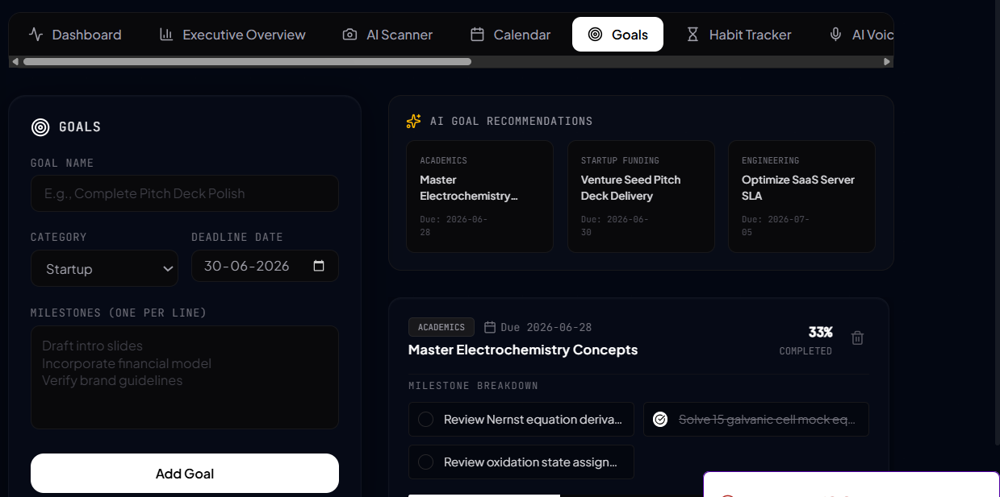
*Figure 13: Sample HTML email digest compiled and sent directly to the user's register address.*
* **Key Functionality**: Managed server-side via Node-cron schedules and Nodemailer, analyzing database state variables to send summary updates.

### 14. Interactive Performance Analytics
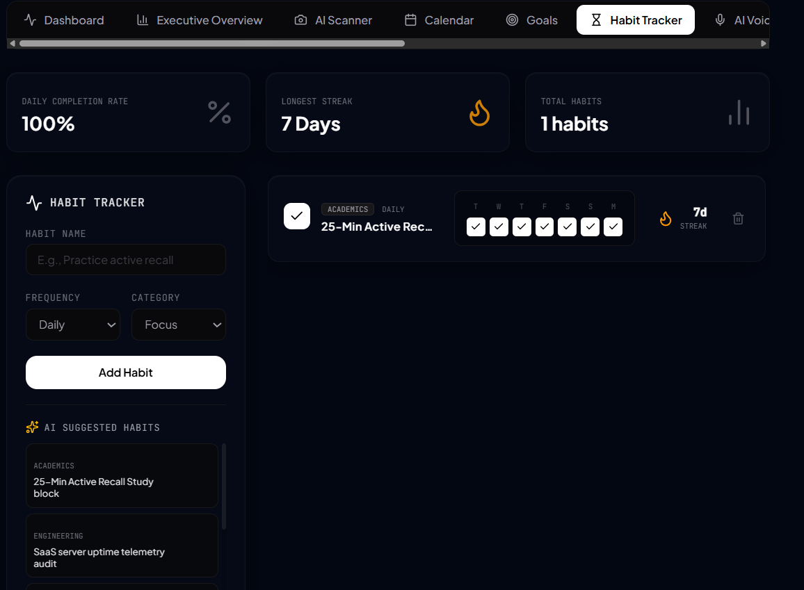
*Figure 14: Quantitative analytics screen visualizing completion rate distributions and productivity metrics.*
* **Key Functionality**: Interacts with active records to render dynamic Recharts illustrating task categories and weekly performance ratios.

### 15. Advanced Settings Console
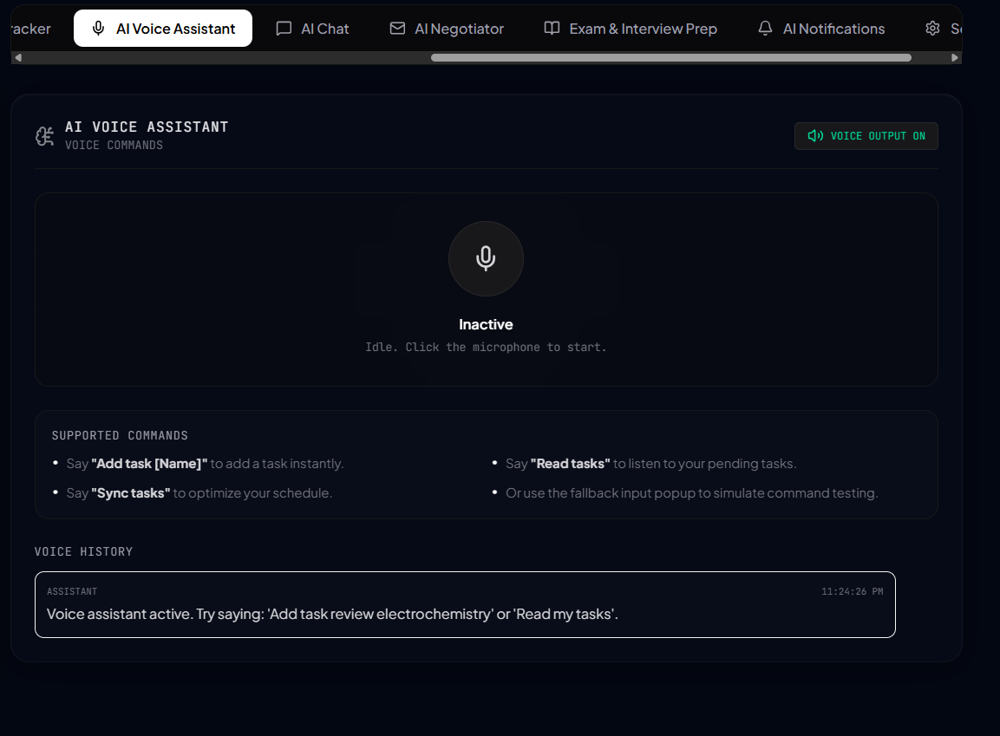
*Figure 15: Configuration hub for daily working hour ranges, alert parameters, and network status checks.*
* **Key Functionality**: Writes personalized preference values directly to `/api/settings` persistence layers.

### 16. Security & Credentials Controller
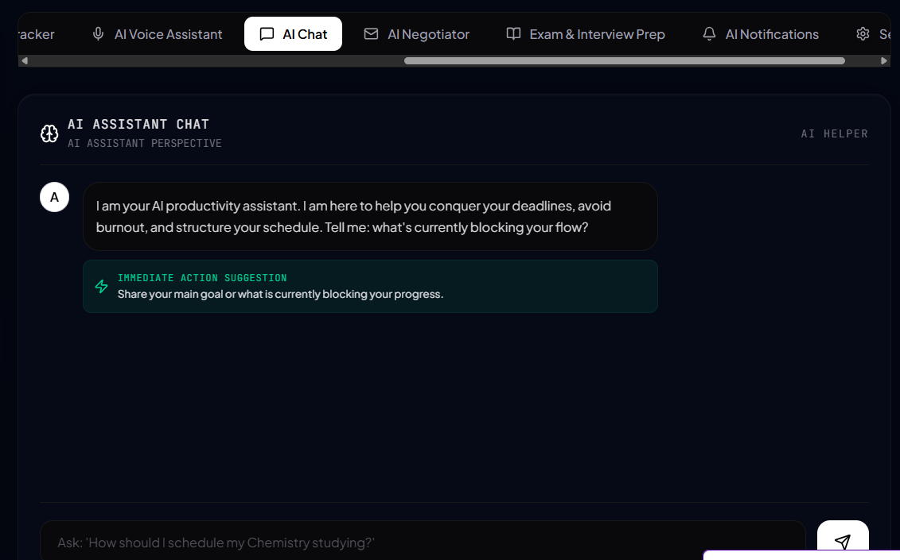
*Figure 16: Security controls for verifying active tokens, changing passwords, and terminating sessions.*
* **Key Functionality**: Integrates JWT-based validation layers, protecting account security and monitoring unauthorized access attempts.

### 17. Persistent Profile & Avatar Customizer
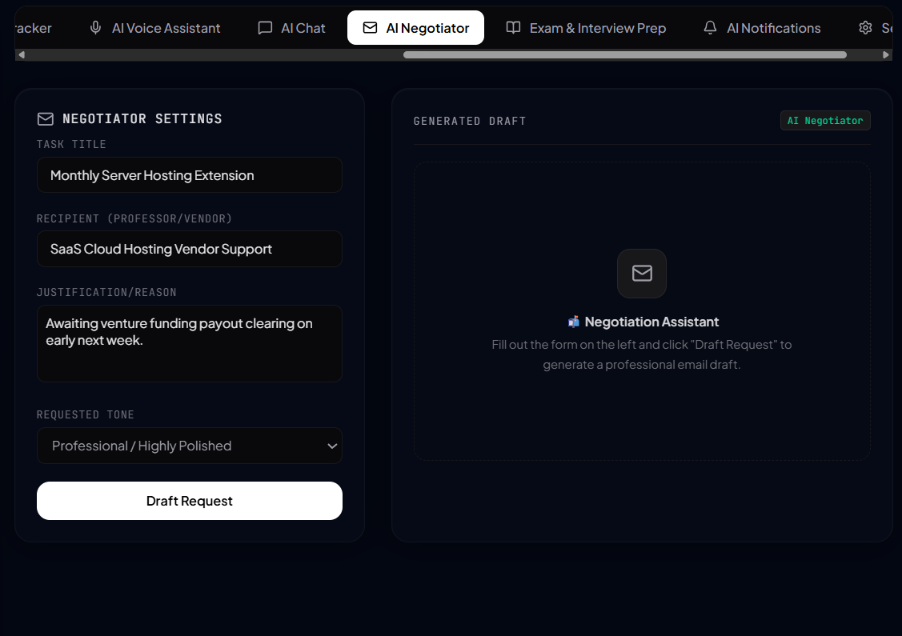
*Figure 17: Profile configuration workspace supporting custom handles, roles, and photo uploads.*
* **Key Functionality**: Supports uploading JPG, PNG, JPEG, or WEBP files up to 5MB, saving paths to the User model and reloading them instantly.

### 18. Interactive Swagger Spec API Portal
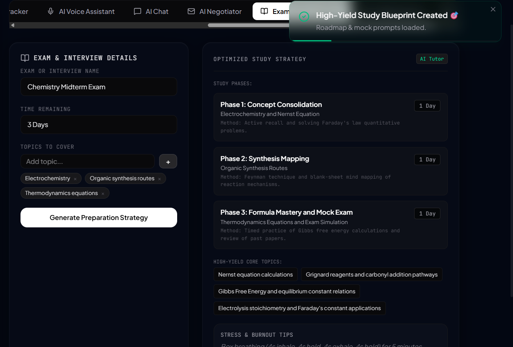
*Figure 18: Integrated Swagger/OpenAPI 3.0 specification UI for exploring and executing endpoint requests.*
* **Key Functionality**: Serves `/api-docs` and `/swagger` directly, providing a pre-loaded quick-auth JWT helper for live development testing.

### 19. AI Voice Assistant Command Centre
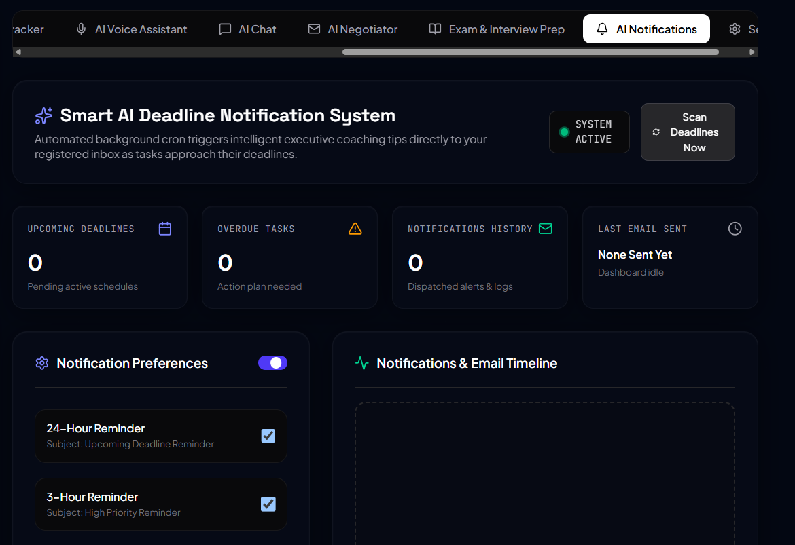
*Figure 19: Vocal interface translating microphone speech inputs to task updates and audio text-to-speech.*
* **Key Functionality**: Converts speech strings to structured JSON payloads on-the-fly, modifying database checklists and calendar blocks.

### 20. Syllabus Prep & Exam Scheduler
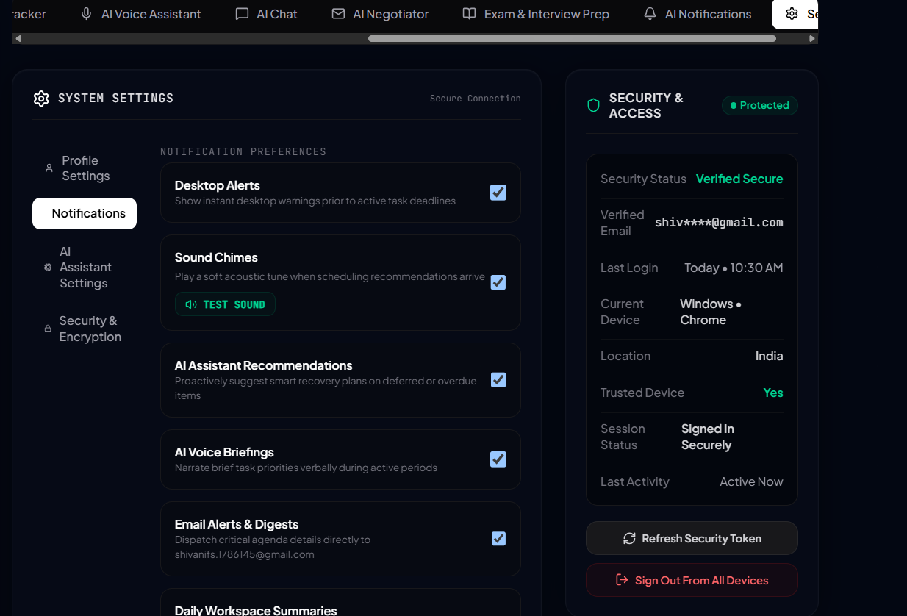
*Figure 20: Curriculum decompressor setting chronological study tracks for upcoming syllabus blocks.*
* **Key Functionality**: Utilizes `POST /api/ai/prepare` with Google Gemini to divide complex syllabi into discrete daily study items.

### 21. Light Theme & Toggle Mechanics
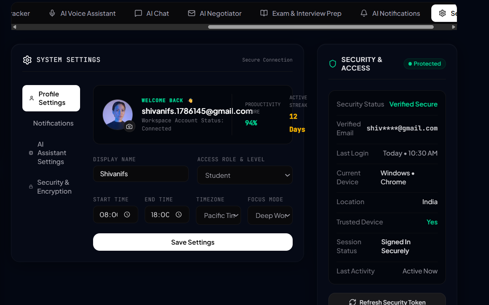
*Figure 21: High-contrast light styling layout with crisp border parameters and enhanced text visibility.*
* **Key Functionality**: Pure client-side toggle persisting state settings inside standard localStorage to adapt workspace views.

---

## 13. INSTALLATION GUIDE

Ensure you have Node.js (version 18 or above) installed on your system.

### Step 1: Clone the Repository
```bash
git clone https://github.com/ShivaniNagda/lifesaver-ai-os.git
cd lifesaver-ai-os
npm install
```

### Step 2: Establish the Environment File
Create a `.env` file in the root directory. Populating credentials and secrets is recommended for optimal performance:
```env
# Server configuration
PORT=3000
JWT_SECRET=your_jwt_secret_here

# Database setup (Defaults to local files if MONGODB_URI is left empty)
MONGODB_URI=your_mongodb_connection_string

# Google Gemini AI Integrations
GEMINI_API_KEY=your_google_gemini_api_key_here

# Mailing Service Credentials (Optional)
EMAIL_HOST=smtp.gmail.com
EMAIL_PORT=587
EMAIL_USER=your_smtp_email_address
EMAIL_PASS=your_smtp_app_password
```

### Step 3: Run the System
```bash
# Start development environment
npm run dev

# Build production assets
npm run build

# Start production server
npm start
```

---

## 14. DEPLOYMENT PROTOCOLS

### General Container Deployment
The application is fully containerization-friendly and optimized for deployment to platforms such as **Google Cloud Run**, Amazon ECS, or modern virtual private servers (VPS).
- **Express Port Binding:** The server binds automatically to `0.0.0.0:3000` to handle container ingress configurations.
- **Optimized Asset Delivery:** Production builds precompile client-side React assets directly to `/dist`. These static files are served directly by the Express backend, ensuring unified routing and avoiding CORS issues.

### Persistent Fallback Handling
In serverless environments or instances deployed without MongoDB connections, the server automatically defaults to local file persistence under the `./data/` directory.

---

## 15. TESTING SUITE

| Module | Status |
| :--- | :---: |
| **Authentication** | ✅ Tested |
| **Tasks & CRUD** | ✅ Tested |
| **Goals & Habits** | ✅ Tested |
| **Audio Notification** | ✅ Tested |
| **AI Planner & Auto-Schedule** | ✅ Tested |
| **OCR Schedule Scanner** | ✅ Tested |
| **SMTP Email Digests** | ✅ Tested |
| **Swagger/OpenAPI Spec** | ✅ Tested |
| **Responsive Web Layout** | ✅ Tested |

---

## 16. CHALLENGES & SOLUTIONS

### 1. Browser Autoplay Restrictions
- **Challenge:** Modern web browsers block programmatic sound playback unless the user has actively interacted with the page first.
- **Solution:** Integrated an initialization check that logs warnings gracefully without interrupting the application if a sound cannot play. Audio is initialized upon the user's first click.

### 2. Container Port Restrictions
- **Challenge:** Container deployments often require applications to listen and communicate through a single port.
- **Solution:** Configured Express to serve both backend API routes and compiled React static files on unified port 3000.

### 3. OCR Image Text Extraction Layouts
- **Challenge:** Handwritten planners or complex syllabus charts yield cluttered, unstructured text strings when processed through standard optical readers.
- **Solution:** Passed the parsed OCR text payload to Gemini models with instructions to return structured JSON outputs matching our predefined schema parameters.

---

## 17. FUTURE SCOPE

- **Bidirectional Google Calendar Sync:** Add support for syncing tasks and scheduling slots directly to users' Google Calendar accounts via OAuth 2.0.
- **Native Web Push Notifications:** Implement real-time push protocols to alert users of upcoming deadlines when they are offline or away from the dashboard.
- **Ambient Focus Audios:** Integrate custom ambient focus sounds to support concentration during scheduled calendar segments.

---

## 18. PROJECT STATISTICS

- **Total API Modules:** 11 active operational categories
- **Total Backend Routes:** 49 verified endpoints
- **Total AI Integration Nodes:** 6 Gemini capability functions
- **Total Collections:** 10 schemas
- **Total HUD Widgets:** 7 core visualization modules
- **Total Main Views:** 2 (Landing Portal & Dashboard HUD)
- **Total Core React Components:** 14 modular interfaces
- **Total Notification Options:** 3 (Screen toasts, sound indicators, email summaries)

---

## 19. FINAL VERIFICATION CHECKLIST

- [x] **Secure Authentication Working:** Complete JWT registration, login, and secure sessions.
- [x] **Productivity CRUD Complete:** Full support for managing Tasks, Goals, Habits, and Calendars.
- [x] **Gemini Integrations Active:** AI Planner, Assistant Chat, OCR Scanner, and Negotiator are fully operational.
- [x] **Audio Alerts Active:** Web Audio API sound indicators are fully integrated.
- [x] **Email Briefings Working:** Scheduled digest emails compile and deliver using Nodemailer.
- [x] **OCR Syllabus Reader Active:** Schedule images are parsed and imported in batch.
- [x] **Interactive Dashboard HUD Active:** Live completion gauges, workload insights, and analytics.
- [x] **Swagger Documentation Present:** Fully documented OpenAPI 3.0 specification served at `/api-docs`.
- [x] **Responsive Visual Layout:** UI scales cleanly across mobile, tablet, and desktop viewports.
- [x] **Deployment Ready:** Packaged and configured for easy deployment.

---

## 20. SUBMISSION STATUS

✅ **Ready for Hackathon Submission**

---
