# LifeSaver AI OS

A high-performance, full-stack productivity operating system designed to orchestrate personal workflows, schedule focused deep-work blocks, and balance workloads. Powered by Express.js, React 19, and Google Gemini, it acts as a centralized dashboard to track daily commitments, automate scheduling, monitor consistent habits, and provide proactive strategy recommendations to optimize performance while mitigating burnout.

---

## 🚀 Professional Shields

🛡️ **Project Status & Technology Badges**


---

## 📌 Table of Contents

1. [Project Overview](#project-overview)
2. [Why This Project](#why-this-project)
3. [Features & Capabilities](#features--capabilities)
4. [🎥 Demo](#-demo)
5. [🖼️ Screenshots](#%EF%B8%8F-screenshots)
6. [🧩 Architecture & Workflow](#-architecture--workflow)
7. [💻 Tech Stack](#-tech-stack)
8. [📁 Folder Structure](#-folder-structure)
9. [⚙️ Installation & Setup](#%EF%B8%8F-installation--setup)
10. [🔒 Environment Variables](#-environment-variables)
11. [🔌 API Documentation](#-api-documentation)
12. [🚀 Deployment](#-deployment)
13. [🔮 Future Enhancements](#-future-enhancements)
14. [🤝 Contributing](#-contributing)
15. [📄 License](#-license)
16. [👨‍💻 Author](#-author)

---

## Project Overview

**LifeSaver AI OS** is a full-stack, state-aware productivity dashboard built for individuals handling high-density schedules, academic commitments, or intense professional projects. Unlike standard linear calendars and todo lists, LifeSaver OS integrates a multi-agent decision simulator that models your mental energy and schedules, offering real-time burnout risk gauges and adaptive advice. It features an interactive scheduling grid, voice-activated NLP inputs, long-term strategic goal setting with sub-milestone checks, a habit tracker, and live-scrolling agent diagnostic terminals for direct insight into how the system interprets and maps your workload.

---

## Why This Project

Traditional time management apps treat hours like a static resource, neglecting the human cognitive and emotional factors that dictate focus, stamina, and recovery. **LifeSaver AI OS** was created to address this gap by:

*   **Mitigating Over-Commitment**: The system dynamically calculates burnout risk (using a specialized algorithm based on daily task density, priority ratios, and calendar blocks).
*   **Providing Context-Aware Guidance**: Using server-side integration with the official `@google/genai` SDK, it analyzes personal stress triggers to compile tailored hour-by-hour execution advice.
*   **Encouraging Multi-Modal Interaction**: Users can capture thoughts via traditional inputs, a custom AI assistant chat, or hands-free vocal commands (using the Web Speech API).
*   **Ensuring Reliable Dual-Persistence**: Operates globally with a secure MongoDB database schema, but remains fully functional offline or without cloud configurations via a robust local JSON file persistence layer.

---

## Features & Capabilities

### 🔐 JWT-Secured Access & Autopilot Signup
Includes a complete login, logout, password recovery, and sign-up flow. Requests are verified using server-side signed JSON Web Tokens (JWT) stored securely, providing private, multi-user isolation.

### 🧠 Dashboard & Burnout Risk
Calculates live performance metrics, showing an aggregate success probability gauge and a burnout risk index. A planning module digests user situations, outputting tactical, context-specific executive briefs.

### 📋 Priority Task Checklists
Enables users to catalog discrete goals, commitments, and assignments with high, medium, and low-priority designations. Tasks are dynamically integrated into scheduling buffers.

### 📅 Calendar
An hourly planner allowing users to paint specific blocks of work, meetings, or decompression intervals. Features automated task-scheduling integration to assign workload blocks into clear time slots.

### 🎯 Strategic Goal & Milestone Tracker
Supports establishing high-level long-term objectives with nested milestones. Includes context-aware AI alignment tips to help users decompose complex projects.

### 🔄 Habit Tracker
Logs routine behaviors with category tagging (Aesthetics, Health, Focus, Academics), calculating dynamic consistency percentages and consecutive daily streaks.

### 🎙️ AI Voice Assistant
Hands-free microphone interface enabling users to issue spoken verbal commands like `"Add task draft slide deck"` or `"Read active tasks"`, triggering instant schedule changes and audio-synthesized text-to-speech replies.

### 💬 AI Assistant Chat
A reflective chatbot console where users converse with an AI assistant (representing positive or negative outcomes of current habits and study schedules), aiding motivation.

### 📄 AI Negotiator
Drafts professional, well-reasoned emails or templates requesting extensions on deadlines, adjusted to different tone requirements (e.g., formal, corporate, direct).

### 🖥️ Scrolling Multi-Agent Console
A live simulated agent log detailing background reasoning and decisions. Displays log outputs from specialized planning agents (Priority, Focus, Recovery, Chronos, Planning) for transparent UX.

---

## 🎥 Demo

### Live Demo Link
Experience the deployed application:  
👉 **[LifeSaver AI OS Live Platform](https://ais-pre-ubwrdqw6y656d2w4kttylc-319694471469.asia-east1.run.app/)**

*(A video or animated GIF of the key user flows can be embedded here to demonstrate active voice protocols and real-time scheduling).*

---

## 🖼️ Screenshots

Explore the fully realized dark, sleek cybersecurity-themed user interface designs of **LifeSaver AI OS**:

### 1. Workspace Provisioning (Sign Up)
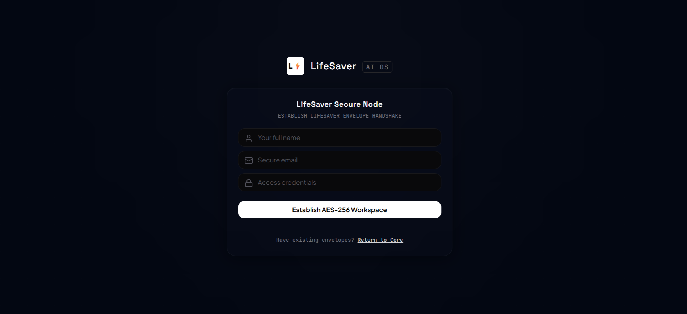
*Establish your private user account to initialize individual workspace storage and session states.*

### 2. Secure Authentication Portal (Login)
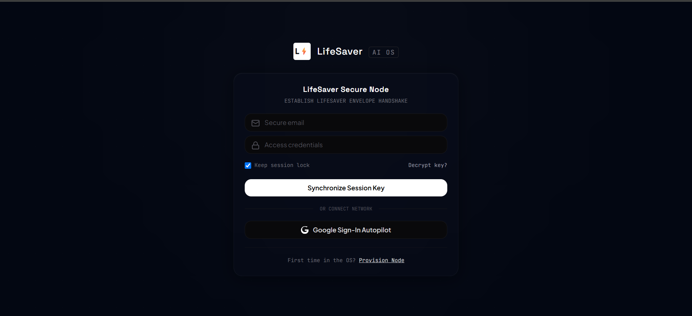
*Secure session unlock interface utilizing token-based verification and a responsive UI theme.*

### 3. Dashboard
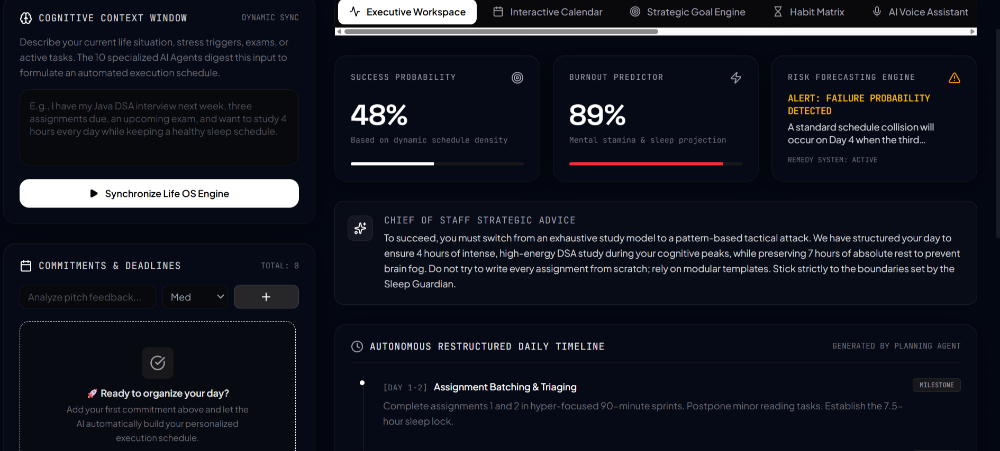
*The centralized workspace showing context inputs, real-time success & burnout indicators, and AI strategic briefs.*

### 4. Interactive Task & Schedule Board
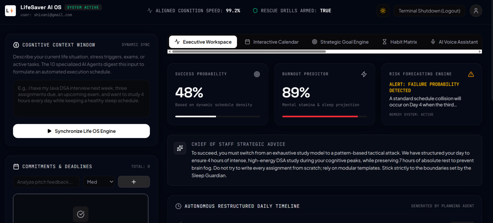
*Commitments module featuring categorized tasks, priority badges, and active completion indicators.*

### 5. Calendar
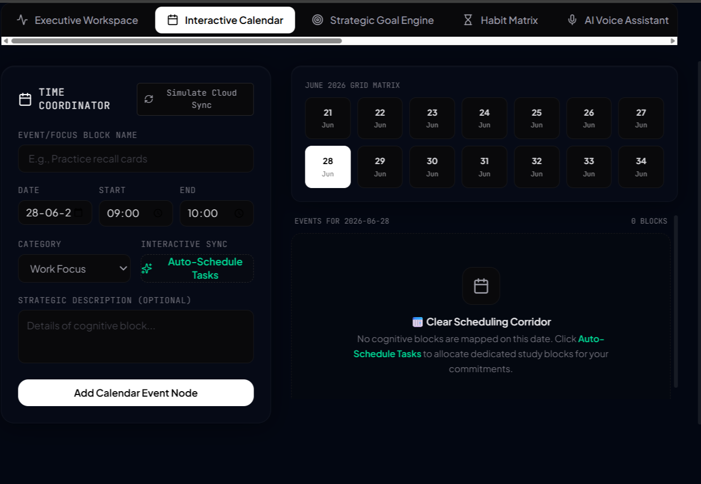
*Grid-based schedule organizer allowing users to program hourly deep-work blocks and sync study milestones.*

### 6. Goals
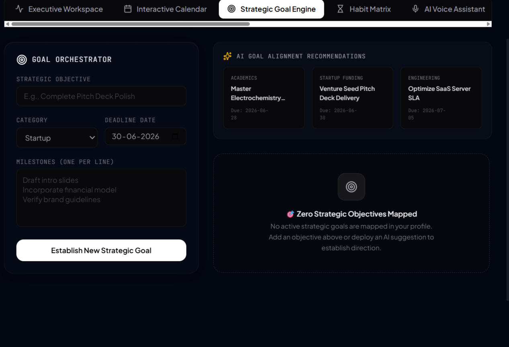
*Milestone tracker featuring long-term objectives and context-aware recommendations mapped by the AI planner.*

### 7. Habit Tracker
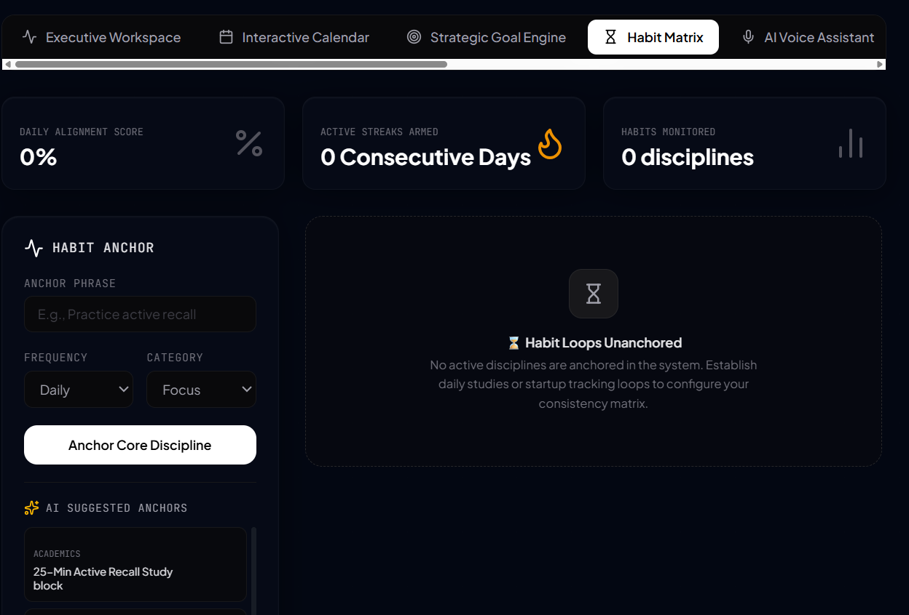
*Habit tracker console displaying daily consistency rings, streak counts, and behavioral tracking widgets.*

### 8. AI Voice Assistant
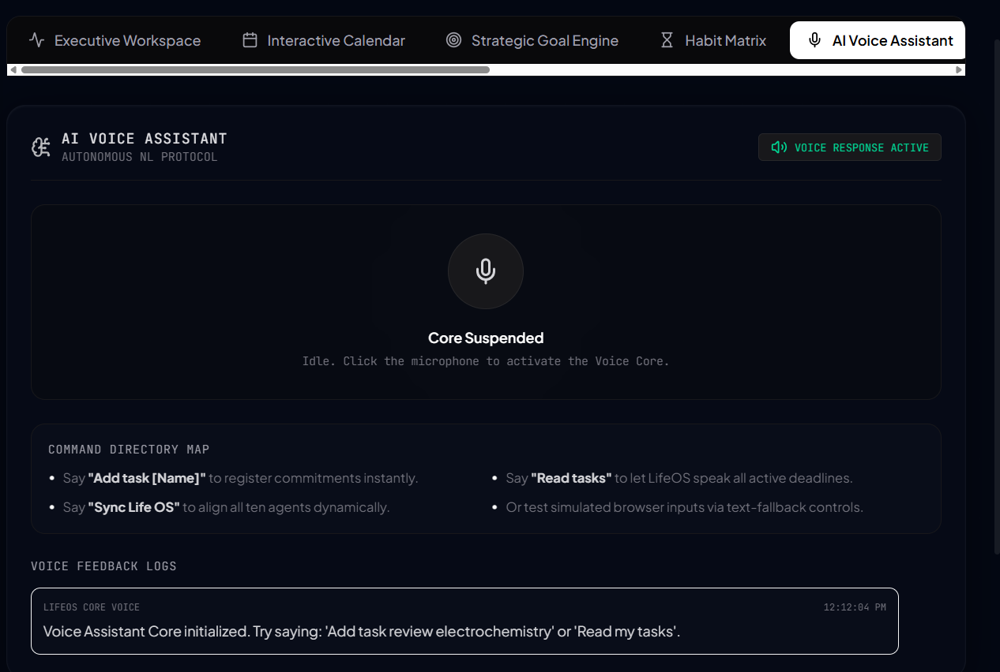
*Hands-free NLP voice controller with simulated transcript log streams and spoken speech feedback.*

### 9. AI Activity Logs
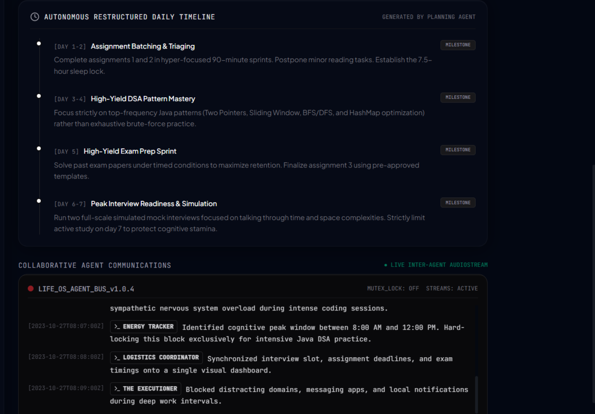
*Real-time scrolling terminal output detailing events and decision logs generated by planning agents.*

### 10. Optimized Light Mode Theme
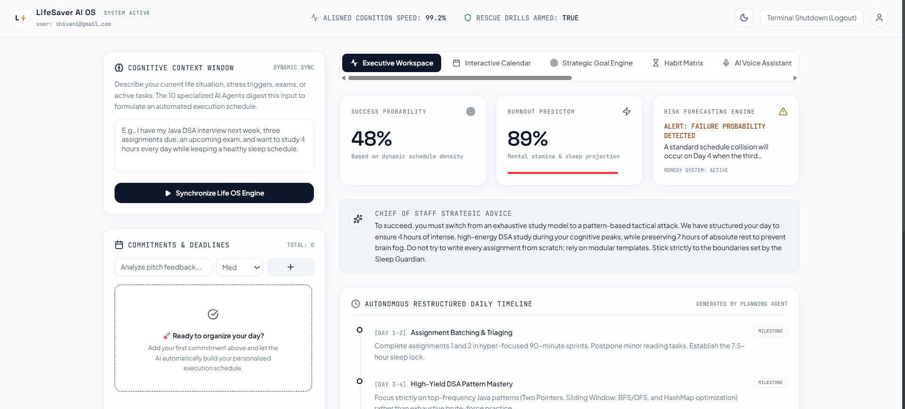
*Alternative high-contrast light theme built with elegant typography and crisp, accessible borders.*

---

## 🧩 Architecture & Workflow

### 📊 System Topology

The diagram below outlines the communication layers between the client UI, Express backend, database repositories, and Google Gemini AI services:

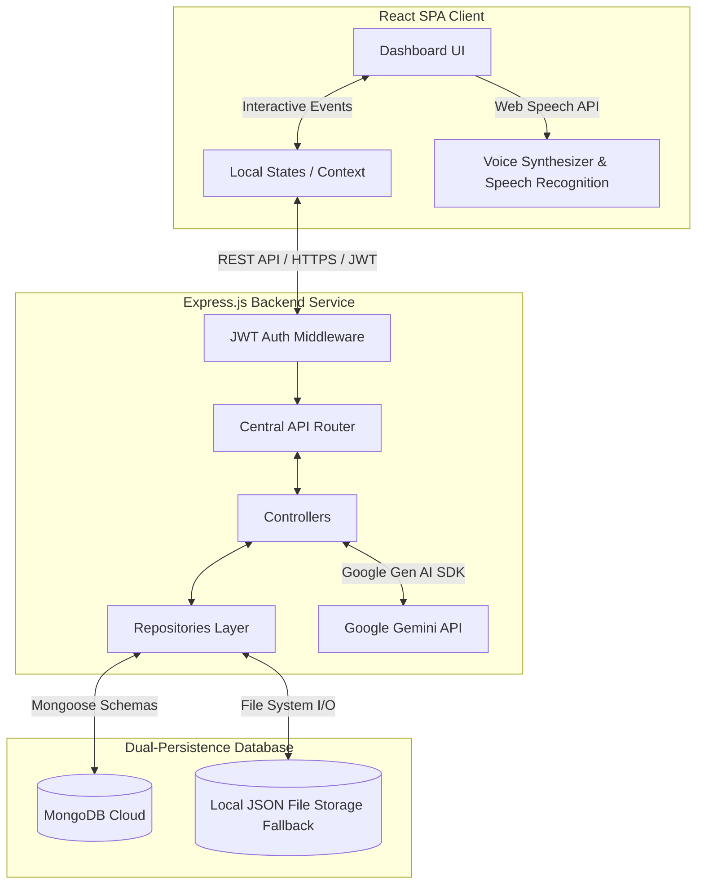

### 🔁 Execution Workflow

1.  **Identity Verification**: The client sends credentials via `POST /api/auth/login`. On success, the server signs a JWT which is stored client-side for all subsequent requests.
2.  **Context Synchronization**: The user writes down active stress elements or exams. This payload is transmitted via `/api/ai/process` where the backend prompts the Gemini engine to parse workload density, yielding strategic recommendations.
3.  **Task Allocation**: Commitments are logged. When requested, tasks are matched against open calendar slots via the `/api/calendar` controller.
4.  **Local/Cloud Sync**: If MongoDB is unavailable, a custom JSON transactional engine intercepts operations, writing changes securely to `/data/*.json` files on disk, ensuring zero downtime.

---

## 💻 Tech Stack

*   **Frontend Library**: React 19 (Functional components, hooks, custom state management)
*   **Primary Language**: TypeScript (Strict type checks)
*   **Styling Engine**: Tailwind CSS v4 (High-fidelity custom dark & light palettes)
*   **Transitions & Motion**: Framer Motion (Hardware-accelerated interface cues)
*   **Icon Assets**: Lucide React
*   **Web APIs**: HTML5 Speech Recognition & Synthesis APIs
*   **Server Runtime**: Node.js & Express.js (v4)
*   **Database**: MongoDB & Mongoose (Object Document Mapping)
*   **Local Resiliency**: File-system based JSON transactional fallback database
*   **Build & Compiling**: Vite (Client bundler), `esbuild` (Server transpiler), `tsx` (TypeScript executing engine)

---

## 📁 Folder Structure

```
.
├── README.md                      # Comprehensive project documentation
├── index.html                     # Frontend entry point template
├── package.json                   # Project scripts and dependencies
├── server.ts                      # Full-Stack entry point (express + vite middleware)
├── tsconfig.json                  # Global TypeScript compiler configurations
├── vite.config.ts                 # Vite bundle parameters
├── README/
│   └── screenshots/               # Standardized application user interface screenshots
│       ├── agent_communication.png
│       ├── ai_voice_assistant.png
│       ├── executive_workspace.png
│       ├── habit_matrix.png
│       ├── interactive_calendar.png
│       ├── lightmode.png
│       ├── login.png
│       ├── main_dashboard.png
│       ├── signup.png
│       └── strategic_goal_engine.png
├── server/                        # Production Express Backend
│   ├── config/
│   │   └── db.ts                  # Mongoose connector with local JSON fallback
│   ├── controllers/               # Route controllers (Auth, Tasks, Goals, AI, Calendar)
│   ├── middlewares/               # Security middleware (JWT authorization validation)
│   ├── models/                    # MongoDB schema specifications
│   ├── repositories/              # Base repositories handling dual-persistence models
│   ├── routes/
│   │   └── api.ts                 # Unified Express API endpoint registry
│   ├── utils/
│   │   └── jsonDb.ts              # Custom transactional local JSON database engine
│   └── validators/                # Input validation logic
└── src/                           # Production React Frontend SPA
    ├── App.tsx                    # Main state coordinators and screen router
    ├── main.tsx                   # Client bootstrap entry
    ├── index.css                  # Global Tailwind imports and theme variables
    ├── types.ts                   # Master TypeScript interfaces and custom unions
    └── components/                # Modular, self-contained dashboard blocks
        ├── CalendarTab.tsx
        ├── GoalsTab.tsx
        ├── HabitsTab.tsx
        ├── LogsTab.tsx
        ├── Navigation.tsx
        ├── TwinChatTab.tsx
        ├── VoiceTab.tsx
        └── WorkspaceTab.tsx
```

---

## ⚙️ Installation & Setup

Ensure you have Node.js (version 18 or above) installed on your system.

### Step 1: Clone and Install
Clone the project repository and navigate into the root directory:
```bash
npm install
```

### Step 2: Establish Your Environment File
Create a `.env` file at the root of your project directory:
```bash
cp .env.example .env
```
Populate the environment variables as detailed in the [Environment Variables](#-environment-variables) section below.

### Step 3: Run the Application in Development Mode
Start the joint Express backend and Vite client server:
```bash
npm run dev
```
The console will indicate that the system is running at `http://localhost:3000`. Open this URL in your web browser.

### Step 4: Build for Production
To bundle and compile the application for production release:
```bash
npm run build
```
This script compiles frontend assets into `/dist` and bundles the Express server into `/dist/server.cjs` using `esbuild`.

### Step 5: Start the Production Server
Deploy the precompiled, lightweight application bundle:
```bash
npm run start
```

---

## 🔒 Environment Variables

The application relies on the following environment variables, configured in your root `.env` file:

| Variable Name | Required? | Default Value | Description |
| :--- | :---: | :--- | :--- |
| `GEMINI_API_KEY` | **Yes** | *None* | Your official Google Gemini API Key. Used for all multi-agent analyses and Twin Chat simulators. |
| `JWT_SECRET` | **Yes** | `lifesaver_os_ultra_secure_secret_token_1867145` | Private cryptographic key used to sign and verify JWT authentication cookies/headers. |
| `MONGODB_URI` | *No* | *None* | Standard MongoDB connection string. If omitted, the application automatically operates with transactional local JSON fallback. |
| `APP_URL` | *No* | `http://localhost:3000` | Host URL utilized to verify routing parameters and deployment headers. |

---

## 🔌 API Documentation

All endpoints (excluding authentication portals) require a valid `Authorization: Bearer <JWT_TOKEN>` header.

### 👤 Authentication Portal
*   `POST /api/auth/register` - Create a new user profile.
*   `POST /api/auth/login` - Authenticate credentials; returns a JSON Web Token (JWT).
*   `POST /api/auth/logout` - Invalidate active login cookies.
*   `POST /api/auth/forgot-password` - Request password reset links.
*   `POST /api/auth/reset-password` - Apply new password via secure reset token.
*   `GET /api/auth/me` - Retrieve metadata of the logged-in user.

### 📅 Productivity & Checklist Engine
*   `GET /api/tasks` | `POST /api/tasks` - Retrieve or append active commitments.
*   `PUT /api/tasks/:id` | `DELETE /api/tasks/:id` - Update status tags, modify priority, or delete tasks.
*   `GET /api/goals` | `POST /api/goals` - Fetch or design long-term objectives.
*   `PUT /api/goals/:id` | `DELETE /api/goals/:id` - Log incremental sub-milestones and verify deadlines.
*   `GET /api/habits` | `POST /api/habits` - Retrieve or register core disciplines.
*   `PUT /api/habits/:id` | `DELETE /api/habits/:id` - Log daily habit completions, trigger streak counters, and adjust frequency.
*   `GET /api/calendar` | `POST /api/calendar` - Retrieve scheduled timeline and calendar events.
*   `PUT /api/calendar/:id` | `DELETE /api/calendar/:id` - Edit block schedules, adjust categories, or drop calendar blocks.

### 🤖 AI Core Operations
*   `POST /api/ai/process` - Parse user situations, run Gemini planning modules, update success/burnout gauges, and retrieve structured schedules.
*   `POST /api/ai/negotiate` - Draft highly optimized deadline extension emails based on tone preference.
*   `POST /api/ai/twin-chat` - Execute prompt-chain requests with your AI assistant.
*   `POST /api/ai/prepare` - Design customized academic study schedules and key exam preparation steps.
*   `GET /api/ai/chat-logs` - Retrieve chat history with the assistant chatbot.
*   `GET /api/ai/agent-logs` - Query live system diagnostics and multi-agent reasoning logs.

### 🔔 Notifications Engine
*   `GET /api/notifications` - Retrieve list of alerts and multi-agent system warnings.
*   `POST /api/notifications` - Register a custom user alert or diagnostic notification.
*   `PUT /api/notifications/:id/read` - Mark a notification as read.
*   `DELETE /api/notifications/:id` - Dismiss or permanently delete a notification.

### 📈 System Metrics & Profile
*   `GET /api/settings` | `PUT /api/settings` - View or update core configuration details.
*   `PUT /api/profile` - Modify name, email, or credentials of the active account.
*   `GET /api/analytics/dashboard` - Fetch aggregated task completion rates, habit metrics, goals completed, and total active calendar slots.

---

## 🚀 Deployment

LifeSaver AI OS is containerization-friendly and ready for deployment onto platforms like **Google Cloud Run**, Heroku, or AWS:

*   **Production Port**: Built to bind automatically to `0.0.0.0:3000` or adapt to container port parameters.
*   **Static Asset Serving**: Vite static builds are precompiled to `/dist` and served statically via the compiled Express handler (`/dist/server.cjs`), eliminating CORS issues and reducing latency.

---

## 🔮 Future Enhancements

We are actively designing updates to expand the capabilities of LifeSaver OS:

1.  **Google Calendar Sync**: Full integration with the Google Calendar API via OAuth 2.0 to write workspace blocks directly to users' real calendars.
2.  **Native Push Notifications**: Integration of Web Push protocols to send real-time burnout alerts and drink-water/break reminders.
3.  **Cross-Platform Mobile App**: Porting client interfaces to React Native to deliver mobile-native performance and widget tracking.
4.  **Collaborative Study Rooms**: Shared interactive calendars and task boards supporting real-time multiplayer coordination.
5.  **Offline Service Worker**: Full Progressive Web App (PWA) configuration enabling offline application access and queuing sync events.
6.  **Wearable Biometrics Integration**: Intercepting real-time heart rate and stress data from wearable sensors (e.g., Apple Watch, Fitbit) to calculate accurate physical burnout metrics.

---

## 🤝 Contributing

Contributions are what make the open-source community such an amazing place to learn, inspire, and create. Any contributions you make are **greatly appreciated**.

1.  Fork the Project.
2.  Create your Feature Branch (`git checkout -b feature/AmazingFeature`).
3.  Commit your Changes (`git commit -m 'feat: Add some AmazingFeature'`).
4.  Push to the Branch (`git push origin feature/AmazingFeature`).
5.  Open a Pull Request.

---

## 📄 License

Distributed under the MIT License. See `LICENSE` for more information.

---

## 👨‍💻 Author

**Shivani**  
*Software Developer | Full-Stack Developer | AI Enthusiast*

*   **GitHub**: [github.com/shivaninagda](https://github.com/ShivaniNagda)
*   **LinkedIn**: [linkedin.com/in/shivani](https://www.linkedin.com/in/shivaninagda/)
*   **Email**: shivaninagda.dev3@gmail.com
